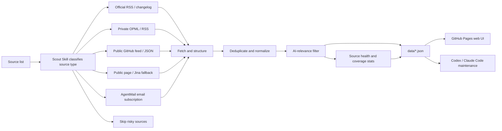

<div align="center">

# AI News Radar

## 24h AI Updates Radar｜Scout Skill

**Scout Skill helps you find the thoroughbreds among a pile of AI sources.**

[](https://learnprompt.github.io/ai-news-radar/)
[](https://github.com/LearnPrompt/ai-news-radar/actions/workflows/update-news.yml)
[](LICENSE)

[Live site](https://learnprompt.github.io/ai-news-radar/) · [中文](README.md) · [Scout Skill](skills/ai-news-radar/README.md) · [Source strategy](docs/SOURCE_COVERAGE.md)

</div>

---

## What is this?

AI News Radar is an auto-updating 24h radar for AI updates.

Readers can open the page and scan the last 24 hours of AI, model, developer-tool, and tech-ecosystem updates. Maintainers can fork this repo and connect their own OPML/RSS, public feeds, static pages, or AgentMail inbox intelligence. Codex / Claude Code-style agents can use the in-repo **Scout Skill** to judge sources, maintain fetch logic, and deploy to GitHub Pages.

This project is not “one more news page”.

Its core is **Scout Skill**. It helps you find the thoroughbreds among a pile of sources. Which sources are worth tracking long term? Which ones should become RSS/OPML inputs? Which ones only make sense through a paid API? Which sources update all day, but have less than 5% AI signal for what you actually care about?

Judge first. Then connect.

## Why Scout Skill?

Good updates are scattered everywhere.

Official blogs publish one thing. Changelogs publish another. Someone drops an early signal on X. Aggregator sites keep reposting the same story.

I thought I was tracking the frontier. Most days, I was repeating the same three chores:

open dozens of pages, filter duplicates by hand, and guess which link was worth reading.

Scout Skill handles the first pass: **which sources are thoroughbreds, and which ones are noise**.

You can keep adding sources freely. You can also put a source into the input set, let it run in a separate view for a month, and decide later whether it deserves to be promoted.

AI News Radar was never just about fetching information.

It is closer to a lightweight news pipeline: source judgement, fetching, deduplication, AI-relevance filtering, source health, and static web publishing. Once deployed, the core flow does not spend model tokens.

## What it can do now

- Track official AI nodes, including OpenAI News, OpenAI Codex Changelog, OpenAI Skills, Anthropic, Google DeepMind, Google AI, Hugging Face, GitHub AI, and more
- Read high-signal public daily digests and newsletters, such as AI Breakfast
- Read feeds exposed by websites themselves, such as Follow Builders for X builders, Anthropic Engineering, Claude Blog, and AI podcasts
- Connect multiple public aggregator sources, including AI HOT, to cover blind spots missed by ordinary official feeds
- Support OPML/RSS batch import, with `feeds/follow.example.opml` as the demo file
- Support AgentMail inbox subscriptions for high-quality AI digests
- Output a 24h two-view UI: `AI-focused` and `All`
- Render bilingual titles and site groups
- Work with Feishu documents, including the latest-day and last-7-days WaytoAGI open-source community changes

## How it works



AI News Radar borrows from modern newsroom workflows. Dumping thousands of items into a page is not useful, so the project turns news handling into a stable pipeline: fetch, deduplicate, filter, add status, and generate a static site.

It stays lightweight on purpose. The public version does not require an LLM API key, login state, cookies, X API access, or email access. When you need advanced sources, Scout Skill can connect them through GitHub Secrets or local environment variables.

## Quick start

Readers do not need to install anything. Open the live site directly.

To fork and customize your own version locally:

```bash
git clone https://github.com/LearnPrompt/ai-news-radar.git
cd ai-news-radar
python3 -m venv .venv
source .venv/bin/activate
pip install -r requirements.txt
python scripts/update_news.py --output-dir data --window-hours 24
python -m http.server 8080
```

Open:

```text
http://localhost:8080
```

If you have your own OPML:

```bash
cp feeds/follow.example.opml feeds/follow.opml
# Put your own subscriptions into feeds/follow.opml. Do not commit this file.
python scripts/update_news.py --output-dir data --window-hours 24 --rss-opml feeds/follow.opml
```

`feeds/follow.example.opml` is a safe demo file. It includes a small set of official AI sources, AI media / builder feeds, and AI newsletters. Use it as a starting point, then keep your real `feeds/follow.opml` private.

## Tutorial for agents

If you want Codex / Claude Code / OpenClaw / Hermes to help you build your own version, say:

```text
Use Scout Skill for AI News Radar. Ask me for my source list first, then decide whether each source should use RSS, public feeds, static pages, Jina fallback, AgentMail email, or be skipped. The goal is to deploy a serverless AI daily news site that updates automatically with GitHub Actions. Do not commit any API keys, cookies, tokens, or private email content into the repo.
```

The in-repo Skill lives at:

- `skills/ai-news-radar/README.md`
- `skills/ai-news-radar/SKILL.md`

When a new agent takes over validation, read these first:

- `README.md`
- `README.en.md`
- `docs/GPT_HANDOFF.md`
- `docs/SOURCE_COVERAGE.md`
- `docs/V2_PRODUCT_BRIEF.md`

## GitHub Actions updates

`.github/workflows/update-news.yml` is already configured.

- Runs every 30 minutes by default
- Automatically generates and commits `data/*.json`
- Uses public demo `feeds/follow.example.opml` when `FOLLOW_OPML_B64` is not configured, so the hosted page can show the RSS/OPML path working
- Decodes `FOLLOW_OPML_B64` into private `feeds/follow.opml` when configured
- Generates a redacted email summary when `EMAIL_DIGEST_ENABLED=1`, `AGENTMAIL_API_KEY`, and `AGENTMAIL_INBOX_ID` are set
- Commits `data/email-digest.json` only when `EMAIL_DIGEST_PUBLISH=1` is also explicitly set
- Uses the official X API during the configured daily UTC window when `X_API_ENABLED=1`, `X_BEARER_TOKEN`, and budget variables are set. This is off by default, and the current X API charges by returned resources.

By default, the core pipeline requires no API keys. Advanced source templates live in `examples/advanced-sources.env.example`; budget notes are in `docs/research/advanced-source-free-tier-budget-2026-05-10.md`; the X API demo config is in `docs/guides/x-api-demo-config.md`; the single-account / single-newsletter demo is in `docs/guides/rileybrown-alphasignal-demo.md`.

## License

[MIT](LICENSE)
